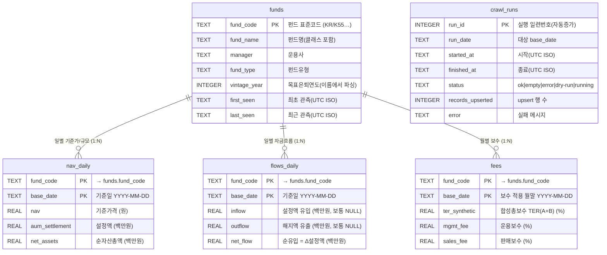

# 🗂 데이터베이스 스키마 & 데이터 사전 (ER 다이어그램 포함)

> `data/tdf.db` (SQLite)의 **모든 테이블·컬럼의 의미·타입·단위·원천**을 정의하는 단일 기준 문서.
> 데이터의 "왜/어떻게"는 [DATA.md](../../DATA.md), 분석 활용은 [분석가 문서](../analyst/README.md) 참고.

---

## 1. ER 다이어그램

`funds`(펀드 식별, 날짜 무관)가 중심이고, 시계열 측정 3종(`nav_daily`·`flows_daily`·`fees`)이
**`fund_code`** 로 연결됩니다. `crawl_runs`는 수집 메타로 독립(분석 대상 아님).



> Mermaid 미지원 뷰어용 ASCII 요약:
> ```
>            ┌─────────┐
>            │  funds  │ (fund_code PK)
>            └────┬────┘
>     fund_code   │ 1
>        ┌────────┼─────────┐
>      N │      N │       N │
> ┌──────────┐ ┌────────────┐ ┌──────┐      ┌────────────┐
> │nav_daily │ │flows_daily │ │ fees │      │ crawl_runs │ (독립)
> └──────────┘ └────────────┘ └──────┘      └────────────┘
>  (PK: fund_code + base_date)              (PK: run_id)
> ```

### 관계·카디널리티
- `funds 1 ─ N nav_daily / flows_daily / fees` : 한 펀드는 여러 날짜의 측정치를 가짐.
- 조인 키: 메타는 `fund_code`, 시계열 정렬·필터는 `(fund_code, base_date)`.
- **FK 주의**: 논리적으로 시계열 3종의 `fund_code`는 `funds.fund_code`를 참조하지만,
  스키마에 `FOREIGN KEY`를 **선언하지 않았습니다**(제약 미강제). 수집 로직이 항상 TDF만
  funds와 시계열에 함께 적재하므로 정합성이 유지됩니다. (대량 수동 편집 시 주의)

---

## 2. 공통 규약 (모든 테이블)

| 항목 | 규약 |
|---|---|
| 날짜 `base_date`/`run_date` | 문자열 `YYYY-MM-DD` (ISO). KOFIA `YYYYMMDD`를 변환해 저장 |
| 타임스탬프 `*_seen`/`*_at` | 문자열, **UTC** ISO-8601 초단위 (예: `2026-06-05T01:42:08+00:00`) |
| 금액 단위 | `nav`=**원**, `aum_settlement`·`net_assets`·`*flow`=**백만원** |
| 비율 단위 | 보수 3종 = **% (연)**. `0.7` = 0.7% |
| 결측 | 미공시/해당없음은 `NULL`(파서가 `''`·`'-'`을 NULL로 변환) |
| 멱등성 | 모든 측정 테이블 PK `(fund_code, base_date)` + `ON CONFLICT DO UPDATE` |
| 타입 | SQLite 동적타입. 선언 affinity는 TEXT/REAL/INTEGER (아래 표) |

---

## 3. 테이블별 데이터 사전

### 3.1 `funds` — 펀드 식별정보 (날짜 무관, 최신값 유지)
한 행 = 한 펀드 **클래스**. KOFIA 기준가 응답에서 발견될 때마다 upsert(이름·운용사 갱신, `last_seen` 갱신).

| 컬럼 | 타입 | 키 | NULL | 의미 | 원천(tmpV / 서비스) | 예시 | 비고 |
|---|---|---|---|---|---|---|---|
| `fund_code` | TEXT | **PK** | N | 펀드 표준코드(KR코드) | `tmpV12` / DISFundStdPriceSO | `K55207CP6080` | 클래스 단위 고유 식별자 |
| `fund_name` | TEXT | | N | 펀드명(클래스·연금 표기 포함) | `tmpV2` | `교보악사평생든든적격TDF2045…(운용)` | TDF 판별 기준 |
| `manager` | TEXT | | Y | 운용사 | `tmpV1` | `교보악사자산운용` | |
| `fund_type` | TEXT | | Y | 펀드유형 | `tmpV3` | `재간접형` | KOFIA 분류 원문 |
| `vintage_year` | INTEGER | | Y | 목표은퇴연도 | 펀드명 정규식 파싱 | `2045` | 4자리(19xx/20xx) 첫 매치. 없으면 NULL |
| `first_seen` | TEXT | | N | 최초 관측 시각(UTC) | 적재 시각 | `2026-06-05T01:42:08+00:00` | upsert 시 보존 |
| `last_seen` | TEXT | | N | 최근 관측 시각(UTC) | 적재 시각 | 〃 | 매 관측마다 갱신 |

### 3.2 `nav_daily` — 일별 기준가·규모 (영업일)
한 행 = 한 펀드의 하루치 가격/규모 스냅샷. **이 프로젝트의 핵심 시계열.**

| 컬럼 | 타입 | 키 | NULL | 의미 | 단위 | 원천(tmpV) | 예시 | 비고 |
|---|---|---|---|---|---|---|---|---|
| `fund_code` | TEXT | **PK** | N | 펀드 표준코드 | — | `tmpV12` | `K55207CP6080` | →`funds.fund_code` |
| `base_date` | TEXT | **PK** | N | 기준일자 | — | `tmpV14` | `2026-06-04` | 영업일 |
| `nav` | REAL | | Y | **기준가격** | 원 | `tmpV6` | `1927.46` | 1좌 기준 공시가 |
| `aum_settlement` | REAL | | Y | **설정액(설정원본)** | 백만원 | `tmpV5` | `15236.0` | **규모 지표로 권장** |
| `net_assets` | REAL | | Y | 순자산총액 | 백만원 | `tmpV9` | `0.0` | 재간접/母 클래스는 0 다수 → 주의 |

### 3.3 `flows_daily` — 일별 자금흐름 (파생)
한 행 = 한 펀드의 하루치 자금 순유입. **KOFIA가 일별 설정/해지액을 깔끔히 제공하지 않아 파생 계산.**

| 컬럼 | 타입 | 키 | NULL | 의미 | 단위 | 산출 | 예시 | 비고 |
|---|---|---|---|---|---|---|---|---|
| `fund_code` | TEXT | **PK** | N | 펀드 표준코드 | — | — | `K55207CP6080` | →`funds.fund_code` |
| `base_date` | TEXT | **PK** | N | 기준일자 | — | — | `2026-06-04` | |
| `inflow` | REAL | | Y | 설정(유입)액 | 백만원 | (미수집) | `NULL` | KOFIA 미제공 → 보통 NULL |
| `outflow` | REAL | | Y | 해지(유출)액 | 백만원 | (미수집) | `NULL` | 〃 |
| `net_flow` | REAL | | Y | **순유입** | 백만원 | 오늘 `aum_settlement` − 직전 영업일 `aum_settlement` | `209.0` | 펀드 최초일은 NULL, 연휴는 직전 '데이터 있는' 영업일 대비 |

### 3.4 `fees` — 보수 (월별, 월말 기준)
한 행 = 한 펀드의 한 월말 보수 스냅샷. **월 단위**로만 의미(일별 변화 없음).

| 컬럼 | 타입 | 키 | NULL | 의미 | 단위 | 원천(tmpV) | 예시 | 비고 |
|---|---|---|---|---|---|---|---|---|
| `fund_code` | TEXT | **PK** | N | 펀드 표준코드 | — | `tmpV15` | `K55207CP5967` | →`funds.fund_code` |
| `base_date` | TEXT | **PK** | N | 보수 적용 월말 | — | 질의일 주입 | `2026-04-30` | 행에 날짜 없어 수집 월말 주입 |
| `ter_synthetic` | REAL | | Y | **합성 총보수·비용비율 TER(A+B)** | % | `tmpV12` | `1.02` | 보수합계(A)+기타비용(B). 사용자 핵심 지표 |
| `mgmt_fee` | REAL | | Y | 운용보수 | % | `tmpV5` | `0.24` | |
| `sales_fee` | REAL | | Y | 판매보수 | % | `tmpV6` | `0.70` | 母/기관 클래스는 NULL일 수 있음 |

### 3.5 `crawl_runs` — 수집 실행 로그 (운영/관측용, 분석 제외)
한 행 = 한 번의 `run`/`backfill` 날짜 처리. 헬스체크·복구·디버깅의 1차 신호.

| 컬럼 | 타입 | 키 | NULL | 의미 | 값 도메인/예시 |
|---|---|---|---|---|---|
| `run_id` | INTEGER | **PK** | N | 실행 일련번호(AUTOINCREMENT) | `42` |
| `run_date` | TEXT | | N | 처리 대상 `base_date` | `2026-06-04` |
| `started_at` | TEXT | | N | 시작 시각(UTC ISO) | `2026-06-05T01:42:08+00:00` |
| `finished_at` | TEXT | | Y | 종료 시각(UTC ISO) | `…:09+00:00` (진행중이면 NULL) |
| `status` | TEXT | | Y | 실행 결과 | `ok` / `empty`(휴장·무데이터) / `error` / `dry-run` / `running` |
| `records_upserted` | INTEGER | | Y | upsert된 행 수 | `7524` |
| `error` | TEXT | | Y | 실패 메시지 | `network down` (성공 시 NULL) |

#### `status` 값 의미
| 값 | 뜻 | 운영 해석 |
|---|---|---|
| `running` | 시작됨(미완) | 비정상 종료 잔여일 수 있음 |
| `ok` | 데이터 적재 성공 | 정상 |
| `empty` | 호출 성공·행 0 | **휴장일**(정상) 또는 구조변경 의심(인접일 확인) |
| `error` | 예외 발생 | 로그/`error` 컬럼 확인 → 개발자 |
| `dry-run` | `--dry-run` 점검 | 저장 안 함 |

---

## 4. 인덱스
| 인덱스 | 대상 | 목적 |
|---|---|---|
| (암묵 PK) | `funds(fund_code)`, 측정3종 `(fund_code, base_date)` | upsert·펀드별 시계열 조회 |
| `ix_nav_date` | `nav_daily(base_date)` | 날짜 단면(그날 전체 TDF) 조회 |
| `ix_flows_date` | `flows_daily(base_date)` | 날짜별 순유입 랭킹 |
| `ix_fees_date` | `fees(base_date)` | 월말 단면 보수 비교 |

---

## 5. 한눈에 보는 단위/주의 카드
- 💴 `nav` = **원** · `aum_settlement`·`net_assets`·`net_flow` = **백만원** · 보수 = **%**
- 📐 규모는 `aum_settlement` 사용(`net_assets`는 재간접/母에서 0 흔함)
- 🧩 행 단위 = 펀드 **클래스**(母펀드 합산은 별도 처리)
- 🗓 `fees`는 **월말 스냅샷**(1~2개월 시차), `nav`는 **영업일**
- 🔁 PK `(fund_code, base_date)`로 **재실행/중복 안전**
